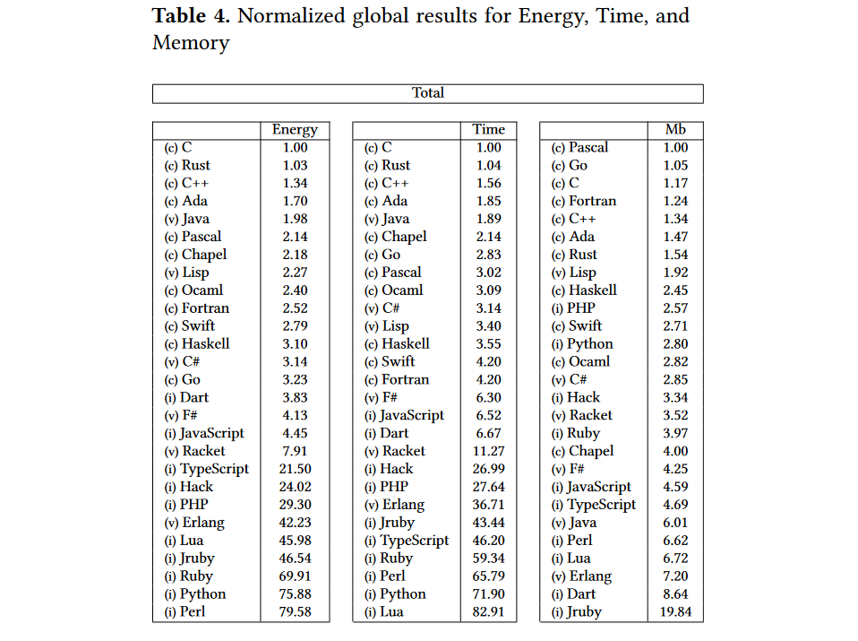

layout: true

.signature[@algogrit]

---

class: center, middle

# Why Rust

Gaurav Agarwal

---

# Agenda

* Rust is *AWESOME*

---

class: center, middle


Software Engineer & Product Developer

Director of Engineering & Founder @ https://codermana.com

ex-Tarka Labs, ex-BrowserStack, ex-ThoughtWorks

---

class: center, middle

*What we wanted*


---

class: center, middle

*What we got*


---

## As a instructor

* I promise to

  * make this class as interactive as possible

  * use as many resources as available to keep you engaged

  * ensure everyone's questions are addressed

---

## What I need from you

* Be vocal

  * Let me know if there any audio/video issues ASAP

  * Feel free to interrupt me and ask me questions

* Be punctual

* Give feedback

* Work on the exercises

* Be *on mute* unless you are speaking

---
class: center, middle

## Class progression


---
class: center, middle

Here you are trying to *learn* something, while here your *brain* is doing you a favor by making sure the learning doesn't stick!

---

### Some tips

* Slow down => stop & think
  * listen for the questions and answer

* Do the exercises
  * not add-ons; not optional

* There are no dumb questions!

* Drink water. Lots of it!

---

### Some tips (continued)

* Take notes
  * Try: *Repetitive Spaced Out Learning*

* Talk about it out loud

* Listen to your brain

* *Experiment!*

---
class: center, middle

### 📚 Content ` > ` 🕒 Time

---
class: center, middle

## Show of hands

*Yay's - in Chat*

---

# Rust

* Memory safe & fast
* Born @ Mozilla
* Performance equivalent to C++
* Ownership & borrowing
* Cargo toolchain
* Binaries!

---
class: center, middle

*Energy Efficient*



.content-credits[https://thenewstack.io/which-programming-languages-use-the-least-electricity/]

---
class: center, middle

# Rust's programming style

---

* Heavily influenced by FP
* Allows imperative as well as functional styles
* Promotes `Object-oriented`ness
* Others

---
class: center, middle

## Heavily influenced by FP

> Haskell, Ruby, Elm, Elixir, F#, Swift, Scala, Clojure, ...

---

```rust
digits.into_iter()
  .rev()
  .enumerate()
  .fold(0, |acc, (i, x)| {
      let v = if i % 2 == 0 || x == 9 { x } else { (x * 2) % 9 };
      acc + v
  }) % 10 == 0
```

.content-credits[https://exercism.io/tracks/rust/exercises/luhn/solutions/9c2d35bc03dd435f9f51015fea70752c]

---
class: center, middle

## Allows imperative as well as functional styles

---

```rust
for _ in _ {

}
```

---
class: center, middle

## Promotes `Object-oriented`ness

---
class: center, middle

## *Others*

---

* Statically typed, type inferred language
* Immutable by default
* References and smart references
* `struct` with methods & associated functions
* Traits
* Rich collection library
* No GC or GC pauses (Optional RC for certain parts)
* Testing and benchmarking
* UTF-8 by default
* Comprehensive standard library...
* and great documentation to go along with it!

---

# Companies using Rust

* Dropbox
* Coursera
* Figma
* Microsoft
* Facebook
* ...
* ...
* ...

.content-credits[https://serokell.io/blog/rust-companies]

---
class: center, middle

## Case-studies

.content-credits[https://serokell.io/blog/rust-companies]

---

### Coursera

Coursera uses Rust for their programming assignments feature where students need to write and run a computer program to solve a problem.

The programs are run, tested, and graded inside *Docker* containers.

For **security** reasons, the developer team needed to use a low-level language like Rust for some of the code, and they decided that Rust is more secure than C.

---

### npm

`npm` is a package manager for JavaScript.

Its engineering team chose to rewrite their main service in Rust because they saw that the service’s performance would soon be a bottleneck if user growth kept up.

They rejected technologies such as C and C++ since they didn’t trust themselves to be able to handle memory management for a web-exposed service.

Java was rejected since it would involve deploying JVM on their servers.

---

### Cloudflare

Cloudflare uses Rust in their core edge logic and as a replacement for C, which is memory-unsafe.

Their GitHub shows 18 open-source repositories that use Rust, and on their blog, they document using it for Firewall Rules, a very customizable firewall tool.

*With a mixed set of requirements of performance, memory safety, low memory use, and the capability to be part of other products that we’re working on like Spectrum, Rust stood out as the strongest option.*

.content-credits[https://blog.cloudflare.com/building-fast-interpreters-in-rust/]

---

### *More*

* [Rust at FB](https://www.youtube.com/watch?v=kylqq8pEgRs)

  > Rust detects large classes of serious bugs at compile time. The cost of a bug at compile time is orders of magnitude less than in production.

* [Why Discord is switching from Go to Rust](https://blog.discord.com/why-discord-is-switching-from-go-to-rust-a190bbca2b1f)

  > They have also rewritten their Read States service in Rust (originally in Go). While the Go version of the service was fast enough most of the time, it sometimes had large latency spikes due to Go’s memory model and garbage collector.

---
class: center, middle

# Where Rust doesn't shine?

---

* Compiler is very slow
* Syntactic overhead
* Verbosity

---
class: center, middle

# Open Source Software

---

* Servo
* OpenEthereum
* Amethyst
* ...

.content-credits[https://serokell.io/blog/open-source-rust]

---
class: center, middle

# Is Rust only a systems programming language?

---
class: center, middle

For the most part, yes!

---
class: center, middle

*but...*

---

* WASM
* Blockchain
* Game Development
* Web Servers

---

# References

* [Why scientists are turning to Rust](https://www.nature.com/articles/d41586-020-03382-2)
* [Experience of using Rust in prod for >6 months](https://www.qovery.com/blog/i-use-rust-in-production-for-6-months-heres-my-feedback)
* [Open Source projects in Rust](https://serokell.io/blog/open-source-rust)
* [Rust Companies](https://serokell.io/blog/rust-companies)
* [Disadvantages of Rust](https://www.reddit.com/r/rust/comments/4b723c/what_are_the_disadvantages_of_rust/)

---
class: center, middle


## Workshop Code & Examples

https://github.com/AgarwalConsulting/Rust-Training

## Slides

https://why-rust.slides.algogrit.com
